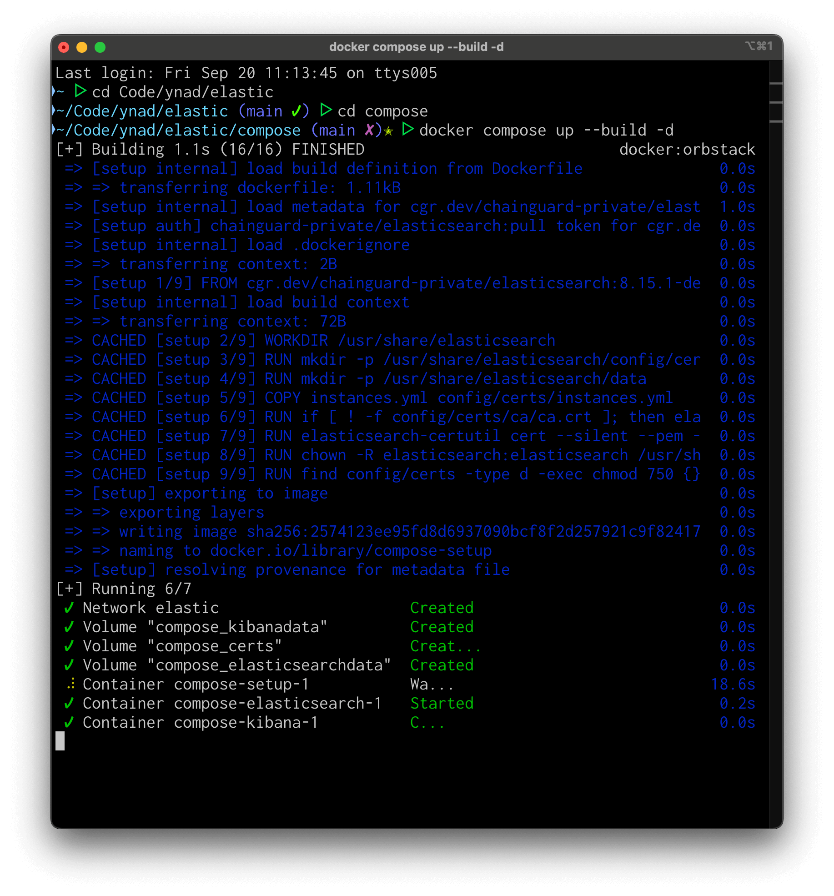
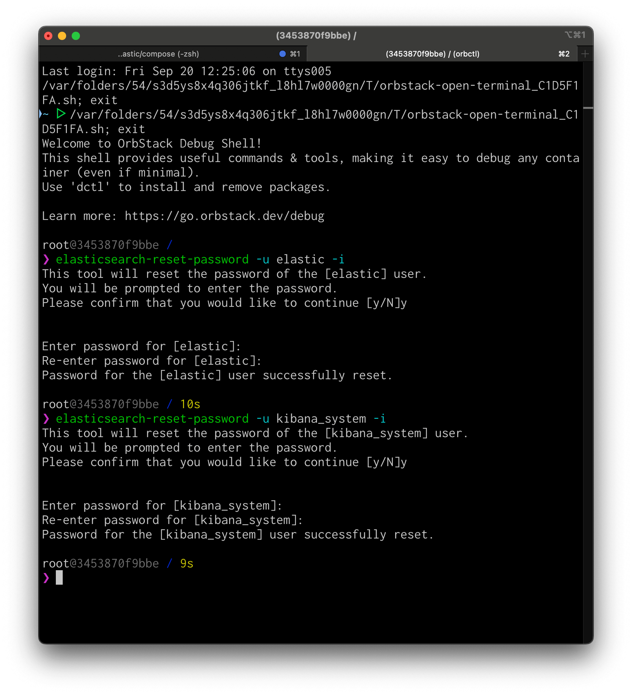
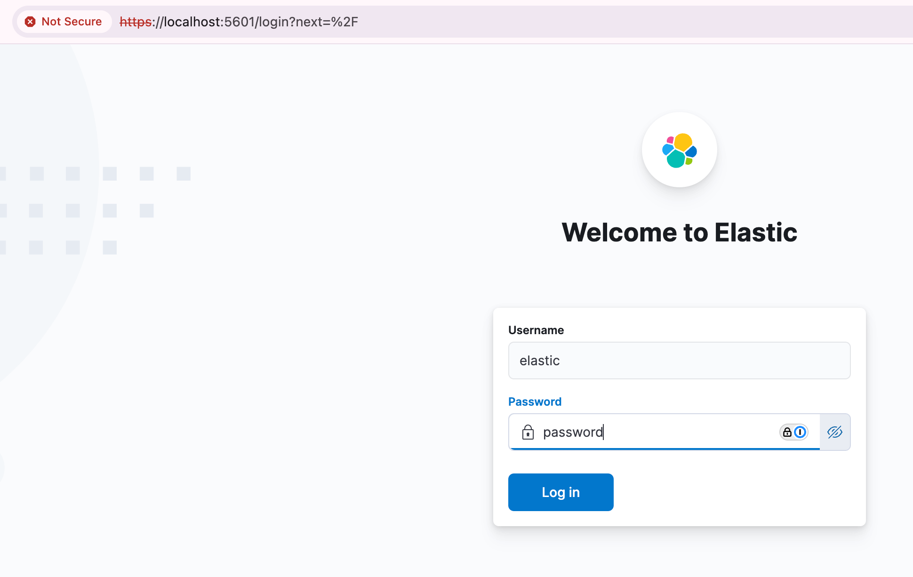
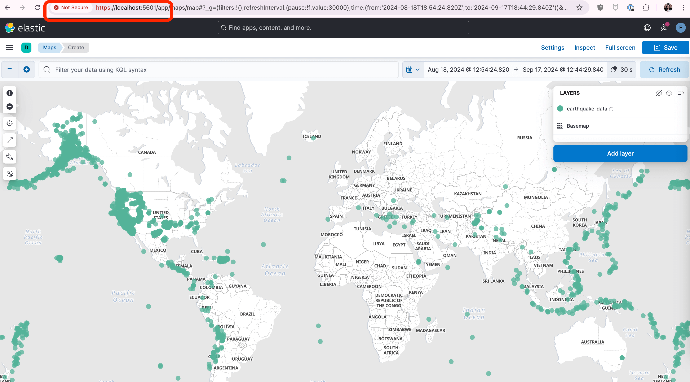

# ssl + compose

cool, so you want a little more compose to stuff.  heads up - afaik, because of the way docker adds environment variables, setting `$ELASTIC_PASSWORD` in the compose file doesn't work.  i tried building it with `FROM image RUN echo >> /etc/profile` shenanigans too, etc., so it'd source correctly, but for some reason, the elasticsearch process doesn't see it except for the root user.  because of this, there's a manual step with a debug shell to set it in the environment, shown at the right step.  i figure no one is _actually_ doing this for production, so this seems to be okay at small scale for demos.

passwords to set for the demo (obvs use whatever you really want)

- `ELASTIC_PASSWORD` = `password`
- `KIBANA_PASSWORD` = `password`

here's how to get going:

1. `cd` into this directory and run `docker compose up --build -d` to start the services.

    

1. while elasticsearch is bootstrapping, open a debug shell attached to the container ([docker desktop](https://docs.docker.com/reference/cli/docker/debug/), [orbstack](https://docs.orbstack.dev/features/debug), probably more).  run the commands below, setting the passwords to `password`.

    

> [!NOTE]
> not wanting to learn the no-shell life yet?  you can change the compose yaml file to use the `-dev` variants of each image, which'll include a shell to use with `docker exec`.

1. navigate to [https://localhost:5601](https://localhost:5601) and log in.

    

1. continue to add data, etc. as you need.  look, the map from still works using the demo data in `data` directory.

    
